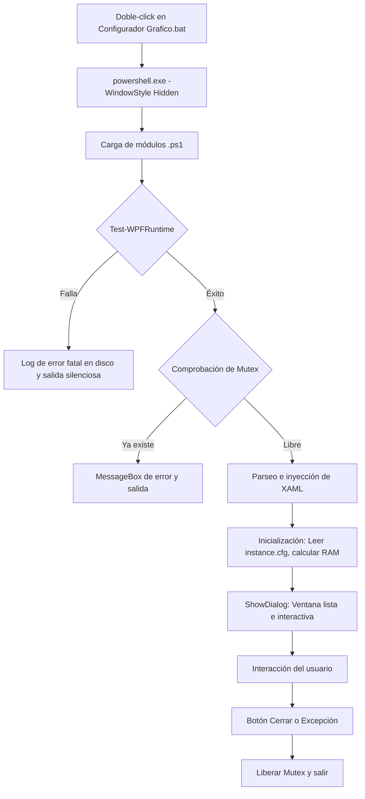

# Documentación Técnica: Configurador 2026UNI

Este documento describe la arquitectura, decisiones de diseño y flujo interno del Configurador Gráfico 2026UNI. Está dirigido a desarrolladores y mantenedores (como Brian) que necesiten comprender el funcionamiento profundo del sistema para depurar errores o realizar modificaciones, sin tener que descifrar el código desde cero.

---

## 1. Diagrama de Flujo (Ciclo de Vida)

---

## 2. Decisiones Técnicas (El Por Qué)

- **Uso de `$PSScriptRoot` en lugar de rutas absolutas:**
  Permite la portabilidad total del modpack. El usuario puede instalar la instancia en `C:\Juegos\2026UNI` o `D:\Minecraft`, y el script siempre encontrará las rutas relativas (`..\..\config\`) sin romperse.

- **Aislamiento de plantillas en `presets_graficos/` respecto a Packwiz:**
  Packwiz se encarga del núcleo de mods, pero los archivos de opciones visuales (`embeddium-options.json`, `oculus.properties`) se mantienen fuera de su control. Si Packwiz los sincronizara, sobreescribiría las preferencias del jugador en cada actualización. La GUI es la única entidad que los altera basándose en la elección del usuario.

- **Uso de backup `.bak-{timestamp}` antes de sobrescribir:**
  Ofrece un mecanismo de *rollback* inmediato ante corrupciones de archivos. La precisión de segundos en el timestamp garantiza que múltiples escrituras rápidas no pisen respaldos previos.

- **Reemplazo con regex por token individual en `JvmArgs`:**
  En lugar de reemplazar toda la línea de argumentos JVM, se operan solo los flags del Garbage Collector (`-XX:+UseZGC`, etc.). Esto preserva cualquier flag personalizado o desconocido que el usuario haya agregado manualmente.

- **Pre-validación de `OverrideJavaArgs=true` y `GarbageCollectorPreset=None`:**
  Prism Launcher (y sus derivados) reescriben el `instance.cfg` al lanzar el juego. Si estas banderas no están configuradas correctamente, el launcher sobrescribiría silenciosamente los cambios que hizo el script en la RAM o el Garbage Collector.

- **Implementación de Mutex de instancia única:**
  Previene la corrupción de archivos. Si dos instancias del configurador leyeran y escribieran `instance.cfg` al mismo tiempo, el archivo se truncaría o generaría conflictos de bloqueo del sistema operativo.

- **Try/Catch global con `MessageBox` de WPF:**
  Dado que el `.bat` lanza PowerShell con `-WindowStyle Hidden` para no mostrar la antiestética consola negra, cualquier error sin atrapar causaría un cierre silencioso (el proceso simplemente desaparece). El Catch global asegura que el usuario vea una alerta y que el error quede en `logs/`.

- **El Cliente Madre como única fuente de verdad:**
  La arquitectura centraliza los cambios en un entorno limpio. Los jugadores consumen actualizaciones pasivamente a través de Packwiz. Modificar la instancia del jugador directamente desincroniza las versiones y hace imposible dar soporte técnico estandarizado.

- **Carpetas `xaero/` y `saves/` son intocables:**
  Estas carpetas contienen datos irremplazables del jugador (mapas, waypoints y mundos de un solo jugador). Cualquier operación de restauración de gráficos los excluye deliberadamente para evitar pérdidas catastróficas.

---

## 3. Desglose de Módulos (Función por Función)

### `Utils.Logging.ps1`
- **`Test-WPFRuntime`**:
  - *Qué recibe*: Nada.
  - *Qué hace*: Intenta cargar los ensamblados base de WPF usando `Add-Type`.
  - *Qué devuelve*: `$true` si carga bien, `$false` si falla, escribiendo un `fatal.log`.
  - *Si falla*: Aborta todo el proceso antes de dibujar la ventana.
- **`Write-Log`**:
  - *Qué recibe*: Mensaje y Nivel (INFO, WARN, ERROR).
  - *Qué hace*: Anexa la línea estructurada con timestamp al archivo de log del día.
- **`Backup-Antes`**:
  - *Qué recibe*: Ruta absoluta de un archivo.
  - *Qué hace*: Copia el archivo a `.bak-{timestamp}`.
  - *Qué devuelve*: `$true` en éxito, `$false` si falla o no existe el archivo origen.

### `Perfil.Manager.ps1`
- **`Get-PerfilActivo`**:
  - *Qué recibe*: Nada.
  - *Qué hace*: Lee `perfil.txt` para saber qué modo (Normal/Lite) está en uso. Devuelve "Normal" por defecto.
- **`Set-Perfil`**:
  - *Qué recibe*: Nombre del perfil ("Normal" o "Lite").
  - *Qué hace*: Sobrescribe `embeddium-options.json`, `oculus.properties` y `options.txt` en la carpeta `config` utilizando los presets del perfil seleccionado.
  - *Qué devuelve*: Booleano según el éxito de la copia múltiple.

### `JVM.Manager.ps1`
- **`Find-InstanceCfg`**:
  - *Qué recibe*: Nada.
  - *Qué hace*: Escanea hacia arriba en el árbol de directorios hasta 6 niveles buscando el `instance.cfg`. Si no, busca en la ruta fallback de APPDATA.
  - *Qué devuelve*: La ruta absoluta al archivo, o `$null` si no lo halla.
- **`Test-InstanceCfgPrereqs`**:
  - *Qué recibe*: Arreglo de líneas (`[string[]]`) del contenido del config.
  - *Qué hace*: Verifica que la instancia esté configurada para no pisar los cambios de Java de manera automática.
  - *Qué devuelve*: Booleano.
- **`Set-MotorGC`**:
  - *Qué recibe*: "ZGC" o "G1GC".
  - *Qué hace*: Extrae los `JvmArgs` y reemplaza el set de banderas correspondientes utilizando regex tokenizadas, manteniendo el resto de argumentos intactos.
  - *Qué devuelve*: Booleano.
- **`Get-RAMRecomendada`**:
  - *Qué recibe*: Nada.
  - *Qué hace*: Consulta a través de WMI/CIM la RAM física del sistema y la libre. Aplica lógica de reserva para Windows según el total disponible.
  - *Qué devuelve*: Un `PSCustomObject` con TotalGB, FreeGB, Recomendado y si amerita Advertencia.
- **`Set-RAM`**:
  - *Qué recibe*: Entero (Gigabytes).
  - *Qué hace*: Traduce GB a MB, actualiza `MaxMemAlloc` y `MinMemAlloc` en `instance.cfg` mediante regex (`-replace`).

### `Graficos.Restaurador.ps1`
Provee las rutinas individuales para reparación:
- **`Restore-Embeddium`**, **`Restore-Oculus`**, **`Restore-OptionsTxt`**:
  - *Qué recibe*: Nada.
  - *Qué hace*: Averigua el perfil activo actual e inyecta únicamente el archivo del preset correspondiente a la configuración base, haciendo backup previo.
  - *Qué devuelve*: Booleano.
- **`Restore-TodosLosGraficos`**: Invoca a los tres anteriores secuencialmente.

### `UI.Theme.ps1`
Define la paleta de colores de manera agnóstica (`$Theme`), evitando colores *hardcodeados* dentro del string de XAML para facilitar temas futuros.

---

## 4. Glosario Técnico

* **WPF/XAML embebido en PowerShell**: 
  El script define la UI como un bloque de texto XML (`[xml]$xaml = @"..."@`) y lo compila en tiempo de ejecución usando `[Windows.Markup.XamlReader]::Load()`. Esto evita depender de binarios de C# compilados, permitiendo editar la UI como texto plano.
* **`Add-Type` y Windows Desktop Runtime**:
  En PowerShell 7+ (Core), el runtime base no incluye subsistemas de interfaz gráfica. `Add-Type` carga dinámicamente bibliotecas del SO, pero para cargar `PresentationFramework` (WPF) el equipo debe tener instalado el "Windows Desktop Runtime".
* **`Get-CimInstance Win32_ComputerSystem` / `Win32_OperatingSystem`**:
  Clases WMI (Windows Management Instrumentation) modernas y rápidas. Proporcionan datos en bruto a nivel kernel sobre el hardware.
* **Por qué `FreePhysicalMemory / 1MB` da GB**:
  WMI devuelve este valor en Kilobytes (KB). En PowerShell, la constante literal `1MB` equivale a 1,048,576 (que es 1024 * 1024). Por ende, dividir `Kilobytes / 1,048,576` es el equivalente matemático a hacer `KB / 1024 / 1024`, cuyo resultado es Gigabytes.
* **Parser estático de PowerShell (`[System.Management.Automation.Language.Parser]::ParseFile`)**:
  Se utiliza internamente por PowerShell para evaluar la sintaxis de un script en memoria (AST) sin ejecutarlo. Garantiza que bloques complejos se procesen adecuadamente antes del paso de ejecución.
* **`-replace` con regex sobre strings**:
  Operador nativo de PowerShell que procesa manipulaciones en la memoria del array iterado. **No** modifica el archivo físico por sí solo; los resultados deben volcarse mediante `Set-Content`.
* **`instance.cfg` (formato Prism INI)**:
  Archivo de metadatos utilizado por derivados de MultiMC/PrismLauncher. Almacena las configuraciones de lanzamiento. Parámetros clave: `JvmArgs` (argumentos puros de Java), `MaxMemAlloc`/`MinMemAlloc` (memoria en MB), `OverrideJavaArgs` (habilita la edición de los args) y `GarbageCollectorPreset` (anula la sobreescritura de los flags de basura del launcher).
* **Mutex global (`Global\nombre`)**:
  Primitiva de sincronización a nivel del núcleo de Windows. El prefijo `Global\` le instruye al sistema operativo que este candado (lock) trascienda las sesiones de usuario locales, haciendo que el mutex sea único en toda la máquina hasta que sea liberado o el proceso muera.
